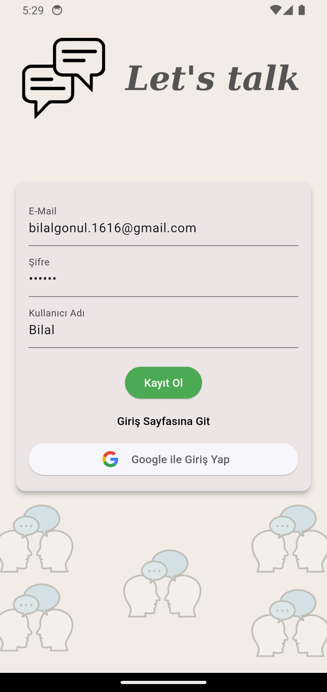
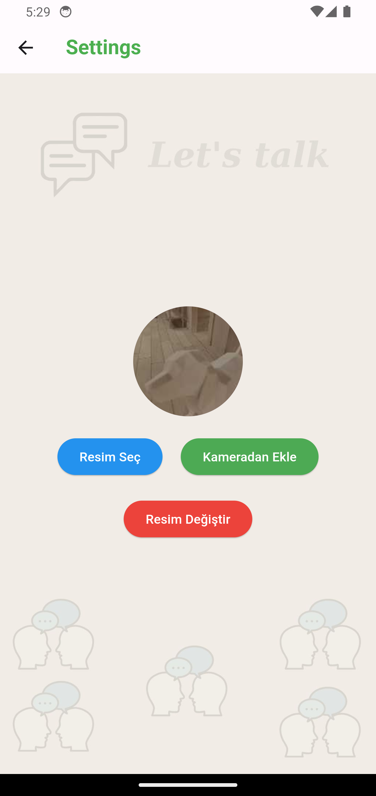
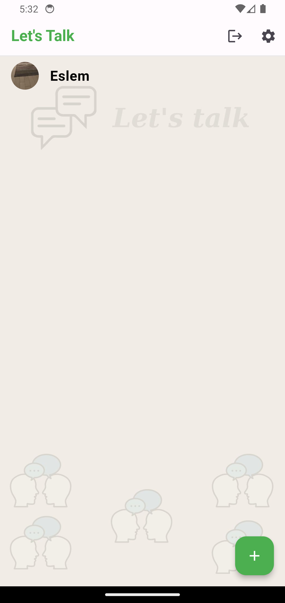
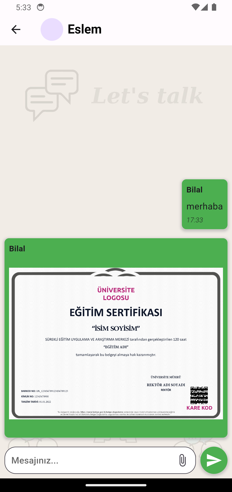

# firebase_chatapp

Flutter ile geliştirilmiş provider mimarisi kullanılarak state yönetimleri sağlanan, kullanıcı kayıt giriş işlemleri ve mesajlaşma depolaması firebase tarafından kaydedilip kontrol edilen mobil chat uygulamasıdır.

## Proje içeriği
- Firebase auth
- Firebase firestore
- Firebase storage
- Provider
 

 

